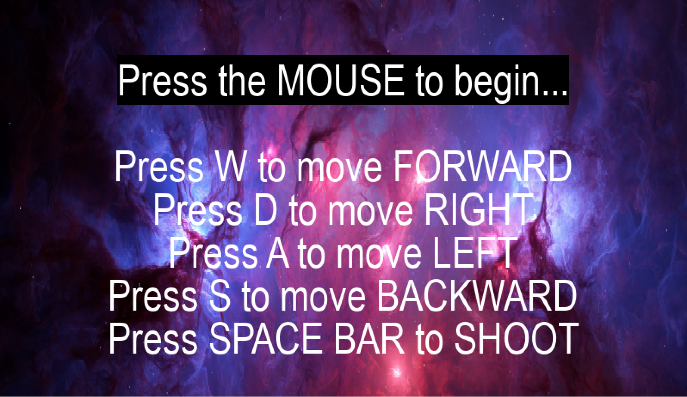
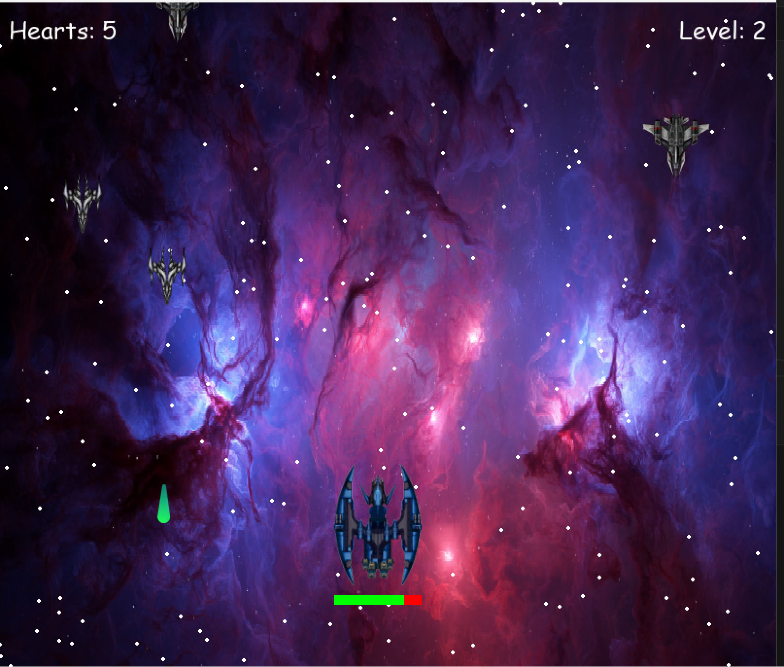

# Galaxy Wars

## Description
Galaxy Wars is an exciting space-themed game developed in Python using the Pygame library. Players control a spaceship, navigating through the galaxy, avoiding obstacles, and battling against various enemies. The game features dynamic levels, enemy waves, and a scoring system, offering a thrilling experience for players of all ages.

## Installation
To play Galaxy Wars, you need Python and Pygame installed on your system. Follow these steps:

1. Ensure you have Python installed from [python.org](https://www.python.org/).
2. Install Pygame: run `pip install pygame` in your terminal.
3. Clone this repository or download the game files to your machine.
4. Navigate to the game's directory and run `python main.py` to start the game.

## How to Play
- Control the spaceship using keyboard keys (W,D,A,S, SPACEBAR).
- Shoot enemies with spacebar.
- Avoid enemy fire and obstacles.
- Defeat enemies to increase your score and progress through levels.

## Features
- Responsive spaceship controls.
- Progressive difficulty with increasing levels.
- Score tracking and high-score system.
- Engaging space-themed graphics and sound effects.

## Contributions
Contributions are welcome! Fork this repository and submit a pull request with your suggestions or improvements.

## License
Galaxy Wars is released under the [MIT License](https://opensource.org/licenses/MIT).

## Acknowledgments
Special thanks to the Pygame community and contributors to this game.

## Screenshots
# Menu

# Gameplay

